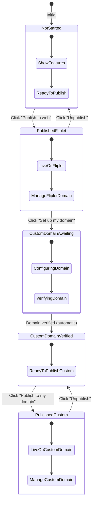
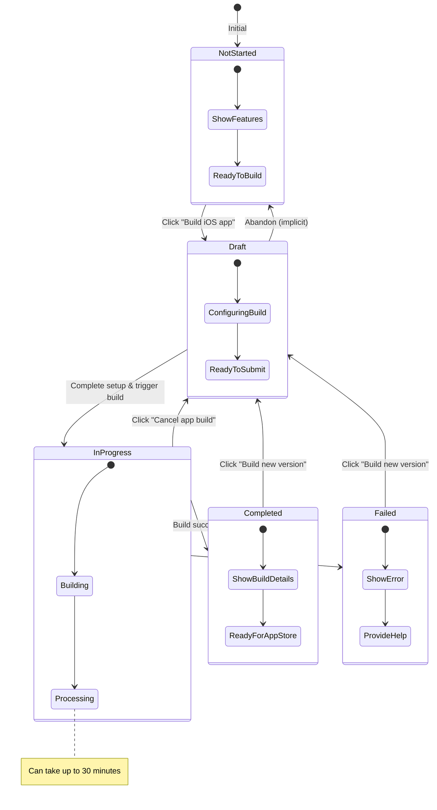
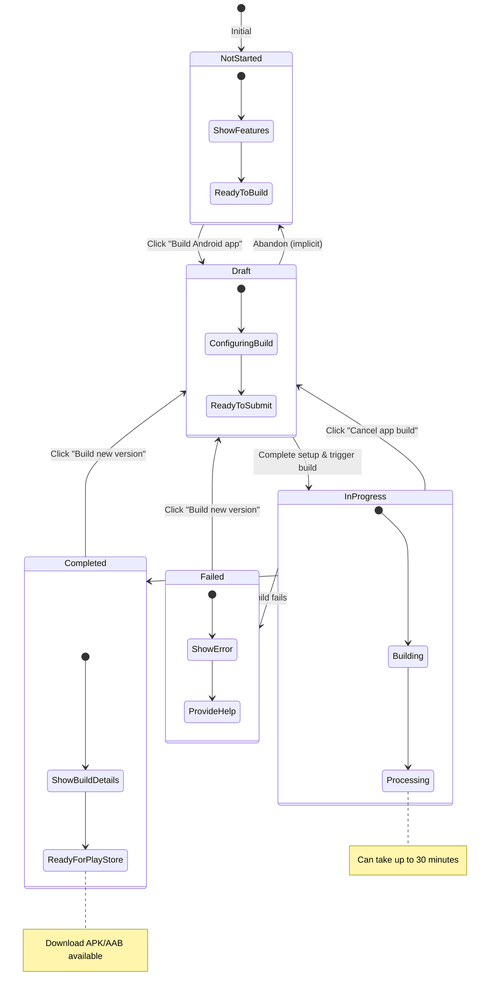

# Dashboard States Documentation

## Purpose

This document provides a comprehensive reference for all UI states of the Publishing Dashboard across the three publishing methods: Web, iOS, and Android. It serves as a guide for developers, designers, and product teams to understand how the dashboard interface changes based on user progress and actions.

## How to Use This Reference

- Each publishing method (Web, iOS, Android) has distinct states that reflect the user's progress
- States are documented with their visual elements, interactive components, and available actions
- Use this document to understand state transitions and implement consistent UI behavior
- Refer to the state transition diagrams to visualize the flow between states

## Publishing Methods Overview

The dashboard supports three publishing methods:

1. **Web Publishing** - Deploy apps to web browsers via Fliplet domain or custom domain
2. **iOS Publishing** - Build and submit apps to the Apple App Store
3. **Android Publishing** - Build and submit apps to the Google Play Store

Each method has its own workflow and states, documented in detail below.

---

## Initial Dashboard State

The initial dashboard state is displayed when a user first accesses the Publishing Dashboard and no publishing actions have been initiated for any platform.

### Visual Layout

The dashboard displays three platform cards stacked vertically:

1. **Web Card** (top)
2. **iOS Card** (middle)
3. **Android Card** (bottom)

### Web Section - Initial State

**Header:** "Web"

**Description:**
"Free web hosting on Fliplet's domain. Instant updates on any browser. Universal access across desktop, tablet & phone. Make it yours with a custom domain."

**Features List** (displayed with green checkmarks):
- Live web link
- Instant updates on any browser
- Google analytics
- Web notifications
- Custom domain
- Specify SEO settings

**Actions:**
- Primary button: "Publish to web" (blue, right-aligned)
- Link: "About Web Publishing" (bottom-left)

### iOS Section - Initial State

**Header:** "iOS"

**Description:**
"Publish your app to the Apple App Store with a friendly, step-by-step wizard—no coding required. From setting up your Apple Developer account to uploading your build and submitting for review, each stage walks you through exactly what to do."

**Features List** (displayed with green checkmarks):
- Apple App Store distribution
- Auto configuration of push notifications
- Fliplet analytics
- Google analytics
- In app notifications

**Actions:**
- Primary button: "Build iOS app" (blue, right-aligned)
- Links (bottom-left):
  - "About iOS Publishing"
  - "Enterprise / Unsigned publishing"

### Android Section - Initial State

**Header:** "Android"

**Description:**
"Deploy your app to the Google Play Store via our clear, step-by-step flow. Configure your Play Console, upload your APK or App Bundle, and roll out updates in minutes—every step explained in plain English."

**Features List** (displayed with green checkmarks):
- Google Play Store distribution
- Auto configuration of push notifications
- Fliplet analytics
- Google analytics
- In app notifications

**Actions:**
- Primary button: "Build Android app" (blue, right-aligned)
- Links (bottom-left):
  - "Signed APK publishing"
  - "About Android Publishing"

---

## Web Publishing States

Web publishing follows a unique workflow that allows users to publish to Fliplet's domain first, then optionally configure and publish to their own custom domain.

### State 1: Not Started (Initial)

**Status:** No publishing initiated

**Visual Elements:**
- Platform card labeled "Web"
- Feature list with checkmarks
- Descriptive text about web hosting capabilities

**Interactive Elements:**
- Primary action button: "Publish to web" (blue, solid)
- Information link: "About Web Publishing"

**User Actions:**
- Click "Publish to web" to initiate web publishing → Transitions to State 2

---

### State 2: Published to Fliplet Domain

**Status:** App is live on Fliplet's domain

**Visual Elements:**

**Section 1: Your own domain**
- Heading: "Your own domain"
- Description: "Launch your web app to a custom domain. Once configured and verified, your web app will be accessible through this custom URL."
- Button: "Set up my domain" (blue, outlined, right-aligned)

**Section 2: Fliplet domain**
- Heading: "Fliplet domain"
- Status badge: "Published" (green checkmark)
- Subtext: "Share the link below with your users."
- Label: "Live web app link:"
- Live URL display: `https://apps.fliplet.com/fliplet-publishing` (in gray box)
- Action link: "Open my app" (blue, right-aligned)

**Action Links (below URL):**
- "Unpublish" (red text)
- "Copy URL" (blue text)
- "Embedded code" (blue text)
- "Edit URL" (blue text)

**Footer Link:**
- "About Web Publishing" (bottom-left)

**User Actions:**
- Click "Set up my domain" to configure custom domain → Transitions to State 3
- Click "Unpublish" to unpublish from Fliplet domain → Returns to State 1
- Click "Open my app" to view live app in new tab
- Click "Copy URL" to copy app URL to clipboard
- Click "Embedded code" to get iframe embed code
- Click "Edit URL" to modify app URL slug

---

### State 3: Custom Domain - Awaiting Verification

**Status:** Custom domain configured but not yet verified

**Visual Elements:**

**Section 1: Your own domain**
- Heading: "Your own domain"
- Description: "You will be able to use custom domain after it is verified. Your app will be automatically published once verification is complete."
- Button: "Settings" (gray, outlined, right-aligned)

**Section 2: Fliplet domain**
- Heading: "Fliplet domain"
- Status badge: "Published" (green checkmark)
- Subtext: "Share the link below with your users."
- Label: "Live web app link:"
- Live URL display: `https://apps.fliplet.com/fliplet-publishing`
- Action link: "Open my app" (blue, right-aligned)

**Action Links:**
- "Unpublish" (red text)
- "Copy URL" (blue text)
- "Embedded code" (blue text)
- "Edit URL" (blue text)

**Footer Link:**
- "About Web Publishing"

**User Actions:**
- Click "Settings" to modify custom domain configuration
- Domain verification happens in background
- Once verified → Automatically transitions to State 4

---

### State 4: Custom Domain - Verified

**Status:** Custom domain verified and ready to publish

**Visual Elements:**

**Section 1: Your own domain**
- Heading: "Your own domain"
- Status badge: "Verified" (green checkmark)
- Description: "Your domain is ready! Click "Publish to my domain" to use it effectively."
- Buttons:
  - "Settings" (gray, outlined)
  - "Publish to my domain" (blue, solid)

**Section 2: Fliplet domain**
- Heading: "Fliplet domain"
- Description: "Web app can be accessed from browsers via shared link. It will be hosted on Fliplet domain https://apps.fliplet.com/."
- Button: "Publish to Fliplet domain" (blue, outlined, right-aligned)

**Footer Link:**
- "About Web Publishing"

**User Actions:**
- Click "Publish to my domain" to publish to custom domain → Transitions to State 5
- Click "Settings" to modify custom domain configuration
- Click "Publish to Fliplet domain" to also publish on Fliplet domain (if unpublished)

---

### State 5: Published to Custom Domain

**Status:** App is live on custom domain

**Visual Elements:**

**Section 1: Your own domain**
- Heading: "Your own domain"
- Status badge: "Published" (green checkmark)
- Subtext: "Share the link below with your users."
- Label: "Live web app link:"
- Live URL display: `app.domain.com` (custom domain in gray box)
- Action link: "Open my app" (blue, right-aligned)

**Action Links:**
- "Unpublish" (red text)
- "Copy URL" (blue text)
- "Embedded code" (blue text)
- "Edit URL" (blue text)

**Button:**
- "Settings" (gray, outlined, top-right)

**Section 2: Fliplet domain**
- Heading: "Fliplet domain"
- Description: "Web app can be accessed from browsers via shared link. It will be hosted on Fliplet domain https://apps.fliplet.com/."
- Button: "Switch to Fliplet domain" (blue, outlined, right-aligned)

**Footer Link:**
- "About Web Publishing"

**User Actions:**
- Click "Unpublish" to unpublish from custom domain → Returns to State 4
- Click "Settings" to modify custom domain configuration
- Click "Switch to Fliplet domain" to publish on Fliplet domain instead
- Click "Open my app" to view live app
- Click "Copy URL", "Embedded code", or "Edit URL" for respective actions

---

## iOS Publishing States

iOS publishing follows a build-based workflow where users configure app settings, initiate builds, and track build progress through various states.

### State 1: Not Started (Initial)

**Status:** No iOS build initiated

**Visual Elements:**
- Platform card labeled "iOS"
- Feature list with checkmarks
- Descriptive text about App Store publishing

**Interactive Elements:**
- Primary action button: "Build iOS app" (blue, solid)
- Information links:
  - "About iOS Publishing"
  - "Enterprise / Unsigned publishing"

**User Actions:**
- Click "Build iOS app" to start iOS build process → Opens setup wizard → Transitions to State 2 (Draft)

---

### State 2: Draft

**Status:** Build configuration in progress, not yet submitted

**Visual Elements:**

**Header:** "iOS"

**Build Status Section:**
- Heading: "App Store app"
- Status badge: "Draft" (gray)
- Description: "To build your iOS app, finish setting up the remaining steps"

**Interactive Elements:**
- Primary button: "Continue setup" (blue, solid, right-aligned)
- Link: "Submission history" (blue text, bottom-left)

**Footer Links:**
- "About iOS Publishing"
- "Enterprise / Unsigned publishing"

**User Actions:**
- Click "Continue setup" to complete build configuration
- Click "Submission history" to view previous build attempts
- Once configuration is complete and build is triggered → Transitions to State 3

---

### State 3: In Progress

**Status:** Build is actively being processed

**Visual Elements:**

**Header:** "iOS"

**Build Status Section:**
- Heading: "App Store app"
- Status badge: "In Progress" (orange/amber)
- Description: "Your app build is in progress. This can take up to 30 minutes. We'll send you an email once your build is finished"

**Interactive Elements:**
- Button: "Cancel app build" (red, outlined, right-aligned)
- Link: "Submission history" (blue text, bottom-left)

**Footer Links:**
- "About iOS Publishing"
- "Enterprise / Unsigned publishing"

**User Actions:**
- Click "Cancel app build" to abort the build → Returns to State 2 (Draft)
- Click "Submission history" to view build history
- Wait for build to complete → Transitions to State 5 (Completed)
- If build fails → Transitions to State 4 (Failed)

**Notes:**
- Build process can take up to 30 minutes
- User receives email notification when build completes
- Progress indicator may be displayed during build

---

### State 4: Failed

**Status:** Build process failed with errors

**Visual Elements:**

**Header:** "iOS"

**Build Status Section:**
- Heading: "App Store app"
- Status badge: "Failed" (red)
- Error message: "{{Error message here}}" (displayed in red text)
- Description: "App build failed. Please review our help documentation for troubleshooting steps, then try building a new version"
- Link in description: "help documentation" (blue, clickable)

**Interactive Elements:**
- Primary button: "Build new version" (blue, solid, right-aligned)
- Link: "Submission history" (blue text, bottom-left)

**Footer Links:**
- "About iOS Publishing"
- "Enterprise / Unsigned publishing"

**User Actions:**
- Click "Build new version" to retry build → Transitions to State 2 (Draft) or State 3 (In Progress)
- Click "help documentation" to view troubleshooting guide
- Click "Submission history" to view error details

**Notes:**
- Error message should provide specific details about build failure
- Common errors: certificate issues, provisioning profile problems, build configuration errors

---

### State 5: Completed

**Status:** Build successfully completed and ready for App Store submission

**Visual Elements:**

**Header:** "iOS"

**Build Status Section:**
- Heading: "App Store app"
- Status badge: "Completed" (green)
- Description: "Follow instructions to complete your app submission on App Store Connect. To publish new version of the app click 'Build new version'"
- Link in description: "Follow instructions" (blue, clickable)

**Build Details:**
- **build:** # 19841
- **Build status:** Completed (Apr 27th 2023, 2:56:43 pm)
- **App version:** 1.0.0

**Interactive Elements:**
- Primary button: "Build new version" (blue, solid, right-aligned)
- Link: "Submission history" (blue text, bottom-left)

**Footer Links:**
- "About iOS Publishing"
- "Enterprise / Unsigned publishing"

**User Actions:**
- Click "Build new version" to create new build → Transitions to State 2 (Draft) or State 3 (In Progress)
- Click "Follow instructions" to view App Store submission guide
- Click "Submission history" to view all builds
- User manually submits to App Store Connect (external process)

**Notes:**
- Build number increments with each successful build
- Timestamp shows completion time in user's timezone
- App version reflects version number configured in build settings

---

## Android Publishing States

Android publishing mirrors the iOS workflow, with build-based states and similar progression through draft, in-progress, failed, and completed states.

### State 1: Not Started (Initial)

**Status:** No Android build initiated

**Visual Elements:**
- Platform card labeled "Android"
- Feature list with checkmarks
- Descriptive text about Google Play Store publishing

**Interactive Elements:**
- Primary action button: "Build Android app" (blue, solid)
- Information links:
  - "Signed APK publishing"
  - "About Android Publishing"

**User Actions:**
- Click "Build Android app" to start Android build process → Opens setup wizard → Transitions to State 2 (Draft)

---

### State 2: Draft

**Status:** Build configuration in progress, not yet submitted

**Visual Elements:**

**Header:** "Android"

**Build Status Section:**
- Heading: "Google Store app"
- Status badge: "Draft" (gray)
- Description: "To build your Android app, finish setting up the remaining steps"

**Interactive Elements:**
- Primary button: "Continue setup" (blue, solid, right-aligned)
- Link: "Submission history" (blue text, bottom-left)

**Footer Links:**
- "Signed APK publishing"
- "About Android Publishing"

**User Actions:**
- Click "Continue setup" to complete build configuration
- Click "Submission history" to view previous build attempts
- Once configuration is complete and build is triggered → Transitions to State 3

---

### State 3: In Progress

**Status:** Build is actively being processed

**Visual Elements:**

**Header:** "Android"

**Build Status Section:**
- Heading: "Google Store app"
- Status badge: "In Progress" (orange/amber)
- Description: "Your app build is in progress. This can take up to 30 minutes. We'll send you an email once your build is finished"

**Interactive Elements:**
- Button: "Cancel app build" (red, outlined, right-aligned)
- Link: "Submission history" (blue text, bottom-left)

**Footer Links:**
- "Signed APK publishing"
- "About Android Publishing"

**User Actions:**
- Click "Cancel app build" to abort the build → Returns to State 2 (Draft)
- Click "Submission history" to view build history
- Wait for build to complete → Transitions to State 5 (Completed)
- If build fails → Transitions to State 4 (Failed)

**Notes:**
- Build process can take up to 30 minutes
- User receives email notification when build completes
- Progress indicator may be displayed during build

---

### State 4: Failed

**Status:** Build process failed with errors

**Visual Elements:**

**Header:** "Android"

**Build Status Section:**
- Heading: "Google Store app"
- Status badge: "Failed" (red)
- Error message: "{{Error message here}}" (displayed in red text)
- Description: "App build failed. Please review our help documentation for troubleshooting steps, then try building a new version"
- Link in description: "help documentation" (blue, clickable)

**Interactive Elements:**
- Primary button: "Build new version" (blue, solid, right-aligned)
- Link: "Submission history" (blue text, bottom-left)

**Footer Links:**
- "Signed APK publishing"
- "About Android Publishing"

**User Actions:**
- Click "Build new version" to retry build → Transitions to State 2 (Draft) or State 3 (In Progress)
- Click "help documentation" to view troubleshooting guide
- Click "Submission history" to view error details

**Notes:**
- Error message should provide specific details about build failure
- Common errors: keystore issues, signing problems, build configuration errors

---

### State 5: Completed

**Status:** Build successfully completed and ready for Google Play Store submission

**Visual Elements:**

**Header:** "Android"

**Build Status Section:**
- Heading: "Google Store app"
- Status badge: "Completed" (green)
- Description: "Follow instructions to complete your app submission on App Store Connect. To publish new version of the app click 'Build new version'"
- Link in description: "Follow instructions" (blue, clickable)

**Build Details:**
- **Build:** #19841
- **Build status:** Completed (Apr 27th 2023, 2:56:43 pm)
- **App version:** 1.0.0

**Interactive Elements:**
- Primary button: "Build new version" (blue, solid, right-aligned)
- Link: "Download app file" (blue text, below build details)
- Link: "Submission history" (blue text, bottom-left)

**Footer Links:**
- "Signed APK publishing"
- "About Android Publishing"

**User Actions:**
- Click "Build new version" to create new build → Transitions to State 2 (Draft) or State 3 (In Progress)
- Click "Download app file" to download APK/AAB file
- Click "Follow instructions" to view Google Play Store submission guide
- Click "Submission history" to view all builds
- User manually submits to Google Play Console (external process)

**Notes:**
- Build number increments with each successful build
- Timestamp shows completion time in user's timezone
- App version reflects version number configured in build settings
- Unlike iOS, Android provides direct download of the build file (APK/AAB)

---

## State Transitions

### Web Publishing State Flow

### iOS Publishing State Flow

### Android Publishing State Flow

---

## UI Elements Reference

### Status Badges

Status badges are small colored labels that indicate the current state of a publishing process.

| Badge | Color | Usage | Platforms |
|-------|-------|-------|-----------|
| **Published** | Green with checkmark | Indicates successful publication | Web |
| **Verified** | Green with checkmark | Indicates domain verification complete | Web |
| **Draft** | Gray | Indicates build configuration in progress | iOS, Android |
| **In Progress** | Orange/Amber | Indicates active build process | iOS, Android |
| **Failed** | Red with error icon | Indicates build failure | iOS, Android |
| **Completed** | Green with checkmark | Indicates successful build completion | iOS, Android |

### Button Styles

#### Primary Action Buttons
- **Style:** Solid blue background, white text
- **Usage:** Main call-to-action buttons
- **Examples:** "Publish to web", "Build iOS app", "Build Android app", "Continue setup", "Build new version"
- **State:** Enabled when action is available

#### Secondary Action Buttons
- **Style:** Blue outline, blue text, white background
- **Usage:** Secondary actions that complement primary action
- **Examples:** "Set up my domain", "Publish to my domain", "Publish to Fliplet domain"
- **State:** Can be enabled or disabled based on conditions

#### Tertiary Action Buttons
- **Style:** Gray outline, gray text, white background
- **Usage:** Settings and configuration actions
- **Examples:** "Settings"
- **State:** Always enabled

#### Destructive Action Buttons
- **Style:** Red outline, red text, white background
- **Usage:** Actions that cancel or remove something
- **Examples:** "Cancel app build"
- **State:** Enabled during cancellable operations

### Text Links

#### Action Links
- **Style:** Blue text, underline on hover
- **Usage:** Secondary actions displayed as links
- **Examples:** "Copy URL", "Embedded code", "Edit URL", "Open my app", "Download app file"

#### Destructive Links
- **Style:** Red text, underline on hover
- **Usage:** Actions that remove or unpublish
- **Examples:** "Unpublish"

#### Informational Links
- **Style:** Blue text, underline on hover, typically smaller font
- **Usage:** Links to documentation and help resources
- **Examples:** "About Web Publishing", "About iOS Publishing", "Submission history", "help documentation"

### Status Indicators

#### Success Indicators
- Green checkmark icon
- Used with "Published", "Verified", "Completed" badges
- Indicates successful completion of a process

#### Warning Indicators
- Orange/amber color
- Used with "In Progress" badge
- Indicates ongoing process that requires waiting

#### Error Indicators
- Red error icon or color
- Used with "Failed" badge
- Indicates process failure requiring user attention

#### Neutral Indicators
- Gray color
- Used with "Draft" badge
- Indicates incomplete or in-preparation state

### URL Display Boxes

- **Style:** Light gray background, monospace font, rounded corners
- **Content:** Displays live web app URLs
- **Behavior:** Read-only, text selectable
- **Examples:** 
  - `https://apps.fliplet.com/fliplet-publishing`
  - `app.domain.com`

### Descriptive Text

#### Headings
- **Platform Headers:** Bold, large font (e.g., "Web", "iOS", "Android")
- **Section Headers:** Semi-bold, medium font (e.g., "Your own domain", "Fliplet domain", "App Store app")

#### Body Text
- **Descriptions:** Regular weight, readable font size
- **Instructions:** Clear, actionable language
- **Error Messages:** Red text for failures, specific and helpful

#### Labels
- **Field Labels:** Small, gray text (e.g., "Live web app link:")
- **Detail Labels:** Bold for field names (e.g., "build:", "Build status:", "App version:")

---

## Notes and Best Practices

### State Persistence
- Dashboard state persists across user sessions
- State is determined by backend data, not UI state
- Page refresh will show current actual state

### Multi-Platform States
- Each platform (Web, iOS, Android) maintains independent state
- Users can have different states for each platform simultaneously
- Example: Web can be "Published" while iOS is "In Progress" and Android is "Not Started"

### Error Handling
- Failed states should always provide actionable error messages
- Error messages should link to relevant help documentation
- Users can always retry from a failed state

### Build Process
- iOS and Android builds can take up to 30 minutes
- Email notifications sent on build completion
- Users can cancel builds that are in progress
- Build numbers increment automatically with each successful build

### Custom Domain Workflow
- Domain verification happens automatically in background
- Users cannot publish to custom domain until verification complete
- Users can maintain both Fliplet and custom domain simultaneously
- Switching between domains is non-destructive

### Submission History
- All platforms track submission/build history
- History accessible via "Submission history" link
- Useful for debugging and tracking progress over time

---

## Related Documentation

- [API Endpoints](./API/01-API-Endpoints.md) - Backend API endpoints for state management
- [Custom Domain Setup](./CUSTOM_DOMAIN_SETUP_DOCUMENTATION.md) - Detailed custom domain configuration guide
- [PRD Phase 1](./PRD/PRD-Phase-1.md) - Product requirements for web publishing
- [PRD Phase 2 - iOS](./PRD/PRD-Phase-2-iOS.md) - Product requirements for iOS publishing
- [PRD Phase 3 - Android](./PRD/PRD-Phase-3-Android.md) - Product requirements for Android publishing
- [UI Guidelines](./PRD/UI-Guidelines.md) - General UI design guidelines
